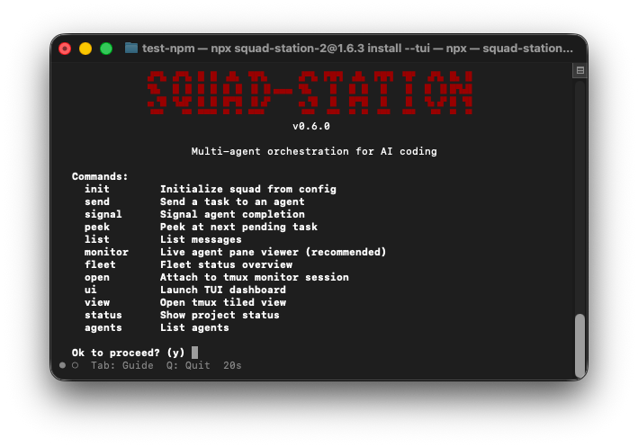

# Squad Station

Message routing and orchestration for AI agent squads — stateless CLI, no daemon.

Squad Station routes messages between an AI orchestrator and N agents running in tmux sessions. It is provider-agnostic: works with Claude Code, Gemini CLI, or any tool. Each project stores its state in a local SQLite database at `.squad/station.db` inside the project directory.

## Installation

### npx (recommended)

```bash
npx squad-station-2@latest install --tui
```



## Quickstart

**Step 1 — Install and follow the TUI wizard:**

```yaml
project: my-app
orchestrator:
  provider: claude-code
  role: orchestrator
  model: sonnet
agents:
  - name: backend
    provider: gemini-cli
    role: worker
    model: gemini-2.5-pro
```

**Step 2 — Open the monitor:**

```bash
squad-station open
```

**Step 3 — Send a task:**

```bash
squad-station send my-app-claude-code-backend --body "Implement the /api/health endpoint"
```

**Step 4 — Signal completion** (from inside the agent's tmux session via hook):

```bash
squad-station signal $TMUX_PANE
```

<<<<<<< HEAD
**Step 5 — Monitor your fleet:**

```bash
squad-station monitor   # Interactive TUI — live agent pane viewer (recommended)
squad-station fleet     # Fleet overview — tasks, busy duration, alignment per agent
squad-station open      # Attach to tmux tiled view of all agent panes
squad-station ui        # TUI dashboard
squad-station status    # Text overview
squad-station list      # Message queue
=======
**Step 5 — Check status:**

```bash
squad-station status           # Agent overview: statuses, pending tasks
squad-station list             # List all messages
squad-station reconcile        # Sync agent statuses with live tmux sessions
```

**Step 6 — Self-healing watchdog** (auto-started by init):

```bash
squad-station watch            # Foreground: reconcile + stall detection + nudges
squad-station watch --interval 30  # Custom interval (seconds)
>>>>>>> upstream/master
```

> **Tip:** `squad-station monitor` is the recommended way to observe your agents in real time. It shows live pane output for each agent in a navigable TUI. Use `squad-station fleet` for a quick summary of pending tasks and agent alignment.

See [docs/PLAYBOOK.md](docs/PLAYBOOK.md) for the complete workflow guide.

## Architecture

Squad Station is a stateless Rust CLI. There is no background daemon. Every command opens the SQLite database, reads or writes, and exits.

<<<<<<< HEAD
- `agents` table — registered agents with `tool` (e.g. `claude-code`, `gemini-cli`), role, model, description, and status
- `messages` table — tasks routed to agents with bidirectional `from_agent`/`to_agent` fields, priority (urgent > high > normal), and a full status lifecycle: `pending → processing → done` (or `failed`)
- tmux sessions — each agent runs in its own named session; `send-keys -l` prevents shell injection; multiline bodies use `load-buffer`/`paste-buffer`
- Inline hooks — `squad-station signal $TMUX_PANE` registered directly in provider stop/completion hooks; no external scripts required

## Providers

| Tool | Provider key | Notes |
|------|-------------|-------|
| Claude Code | `claude-code` | Hook: Stop event |
| Gemini CLI | `gemini-cli` | Hook: AfterAgent event |
| Any IDE (DB-only) | `antigravity` | Skips tmux — orchestrator reads DB directly |
=======
- `agents` table — registered agents with `tool` (e.g. `claude-code`, `gemini`), role, status, `current_task` FK
- `messages` table — tasks routed to agents with bidirectional `from_agent`/`to_agent` fields, priority (urgent > high > normal), and status lifecycle: `processing → completed`
- tmux sessions — each agent runs in its own named session; `send-keys -l` prevents shell injection; `$SQUAD_AGENT_NAME` env var set at launch
- Provider hooks auto-installed by `init` — detect task completion and call `squad-station signal`
- Watchdog daemon — auto-started by `init`, reconciles sessions, detects stalls, nudges idle orchestrators
- Signal logging — structured logs at `.squad/log/signal.log` for debugging signal flow
>>>>>>> upstream/master

## Requirements

Requires: tmux, macOS or Linux (Windows not supported — tmux unavailable).

## License

MIT License

---

Based on [thientranhung/squad-station](https://github.com/thientranhung/squad-station).
